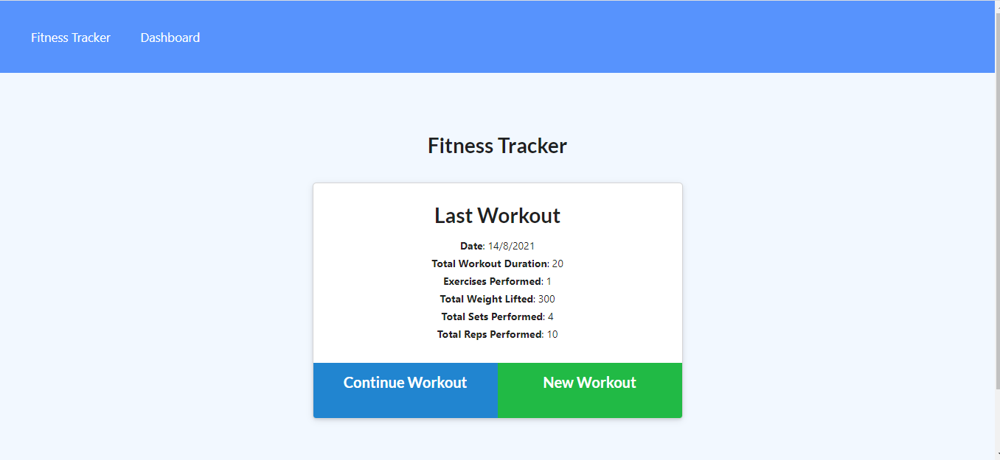
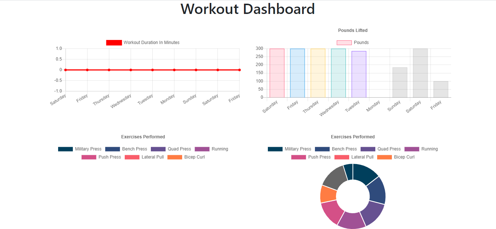
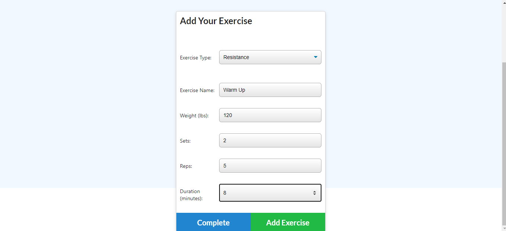

<h1>Fitness Tracker </h1>
  
 

## Description

This app will allow you to add multiple excercises in your workout and show you the results of the overall workout.

## Table of Contents

- [Description](#description)
- [Installation](#installation)
- [Usage](#usage)
- [License](#license)
- [Questions](#questions)

## Installation

* npm i

* Deployed site: https://glacial-oasis-90040.herokuapp.com/

## Usage
* Opening the application will bring up the information of the last workout:

* Clicking the Dashboard tab will bring up the information of your past workouts:

* Clicking Continue Workout or New Workout will let you add the new workout information. Completing the workout will add the duration and number of excercises the workout was composed of.

## License

 
This application is covered by the MIT license. 
## Contributing

## Contact:
 
Find me on GitHub: [adelalama](https://github.com/adelalama) 
 
Email me for any questions:: delalama.7@gmail.com  
    